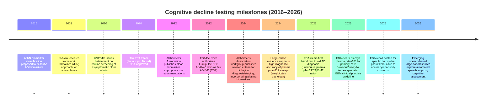

# State of the Art in Cognitive Decline Detection and Testing

## Executive summary

The state of the art (SoTA) for cognitive decline detection and assessment (March 2026) is converging on a **two-layer diagnostic pathway**: (1) **scalable screening/triage** that can run in primary care or remotely with minimal clinician time, and (2) **biological confirmation and staging** (especially Alzheimer’s pathology) using biomarkers and imaging when a patient is symptomatic or when decisions depend on pathology. This convergence is driven by (a) pragmatic implementation research showing that detection can be improved when digital tools are embedded into routine workflow, and (b) rapid advances in blood-based biomarkers, including multiple FDA-cleared in vitro diagnostics in 2025. citeturn1view0turn25search16turn7search2turn6search10

The **anchor “implementation-grade” example** is the pragmatic cluster randomized clinical trial in primary care that combined a brief patient-reported questionnaire (patient QDRS) with an EHR-native machine-learning “passive digital marker” (PDM). The combined approach increased the odds of *new documented* ADRD diagnoses (and downstream diagnostic assessments) versus usual care, whereas the PDM-alone arm did not show the same effect—highlighting that **actionable detection** often needs both “passive signals” and an explicit patient-facing prompt that fits clinical workflow. citeturn25search16turn25search8turn12view0

On the **biomarker side**, the key 2024–2025 inflection point is the move from “research-only” biomarker frameworks toward **biologically anchored diagnosis and staging** and—crucially—**wider access**, with automated plasma assays (p-tau217/p-tau181 plus amyloid-related measures) showing high accuracy for identifying Alzheimer’s pathology in symptomatic patients across primary and secondary care settings. citeturn26search0turn18view1turn7search2turn6search10

For your stated emphasis—**symptomatic impairment (MCI/dementia) in general and middle-aged populations, with heavier coverage of digital/AI-only tests but “biomarker-aware” notes**—the most defensible SoTA picture is:

- **Digital/AI triage is best supported when it is (a) short, (b) repeatable, (c) externally validated, and (d) integrated into workflows** (EHR, primary care visit patterns, or self-administered remote testing) with explicit attention to bias and usability. citeturn25search16turn11view0turn13view1turn16view0turn14search17  
- **Blood-based biomarkers have moved from “promising” to “deployable in defined clinical contexts,”** but their highest-confidence use remains: symptomatic patients, interpreted alongside clinical evaluation, often with confirmatory testing (or two-cutoff “intermediate zone” strategies). citeturn20search1turn18view1turn7search2turn6search10turn18view2  
- **Post-market reality matters**: even FDA-cleared tests can face performance issues requiring recalls/corrections, reinforcing the need for quality systems, drift monitoring, and site-level validation. citeturn8view0turn24search7  

## How SoTA is defined for this brief

SoTA in cognitive decline testing is not a single “best test.” It is the **best-supported combination of tools** for a given purpose, population, and setting, evaluated across: diagnostic target, operational constraints, evidence strength, generalizability, bias, and downstream clinical value. citeturn20search1turn18view2turn23search2

This brief assumes the ADRD spectrum broadly, but it separates three decision-relevant targets that are commonly conflated:

**Cognitive syndrome detection (symptoms):** identify whether a person currently has objective impairment consistent with MCI/dementia (all-cause), usually via cognitive testing plus functional history. citeturn25search8turn15view0turn16view0  

**Etiologic attribution (cause):** determine whether impairment is consistent with Alzheimer’s pathology vs non-AD causes (vascular, Lewy body, FTD, mixed), which increasingly depends on biomarkers and imaging rather than symptoms alone. citeturn26search0turn18view2turn26search20  

**Prognosis/longitudinal prediction:** forecast conversion (e.g., aMCI → AD dementia in ~5 years) or progression speed, typically requiring longitudinal cohorts, robust reference standards, and careful handling of prevalence and competing risks. citeturn9view0turn17view0turn18view1  

A key constraint—central to interpreting PPV/NPV—is that **test utility depends on base rates** (prevalence) *in the tested population*; this is why many guidelines and FDA clearances emphasize symptomatic patients and warn against general population screening claims. citeturn7search2turn6search10turn27search2turn18view2  

## Digital and AI-first approaches for scalable detection

Digital/AI approaches are best understood as a spectrum from “passive risk flags” to “active cognitive measurement.” SoTA is increasingly the **integration** of both, not either alone. citeturn25search16turn11view0turn12view0

**EHR-native phenotyping and risk flagging.** The anchor model (patient QDRS + PDM in primary care) demonstrates a pragmatic pattern: (1) a patient-completed tool that surfaces symptoms/concerns, and (2) an EHR-trained ML model that uses structured + unstructured data (including NLP over notes) to identify risk. In the randomized trial, the combined approach increased new documented ADRD diagnoses and increased follow-up diagnostic assessments, whereas the PDM-only approach was not sufficient to produce the same outcome effect—underscoring that real-world detection is sociotechnical (signal + workflow + action). citeturn25search16turn25search8turn25search0turn25search3

Complementary evidence comes from eRADAR, an EHR-based predictive rule developed to identify older adults at risk of undiagnosed dementia using routinely collected clinical data; external validation across two real-world health systems reported AUC ~0.84 and ~0.79 and examined stability across time and race/ethnicity (with limited precision in smaller groups). citeturn11view0turn4search27

**Digital cognitive assessments (DCA) and next-generation “instrumented” tasks.** A major SoTA theme is turning classic neuropsychological tasks into digital tasks that capture **process signals** (timing, latencies, micro-errors, dynamics) rather than only final answers. The digital clock drawing family is a canonical example: DCTclock operationalizes drawing behavior and timing, and studies report discrimination between diagnostic groups and associations with Alzheimer’s biomarkers (amyloid/tau PET) even among cognitively normal older adults—supporting the idea of “subtle cognitive/behavioral signatures” detectable earlier than conventional scoring. citeturn14search17turn14search1

The Digital Clock and Recall (DCR) extends this approach to a short, primary-care-friendly format (clock + word recall) and has peer-reviewed evidence of improved classification versus MMSE (AUC ~0.70 vs ~0.63 in one study) and claims of reduced ethnic bias in performance, though—as with most cognitive screening—site, sampling, and reference-standard details drive how transportable these results are. citeturn28search2turn13view1

**Short, language-light computerized tasks with AI scoring.** The Integrated Cognitive Assessment (ICA) is a 5-minute rapid categorization task paired with an AI model; a multi-cohort study reported AUC values around 0.81 (MCI) and 0.88 (mild AD) with smaller correlation with education than MoCA/ACE, positioning it as a “low language/culture load” candidate for broader screening—while still requiring external validation for unsupervised home use and for non-AD etiologies. citeturn16view0turn10search1

**Remote-ready digital test batteries.** BrainCheck illustrates a more conventional multi-domain digital battery with published diagnostic accuracy on small-to-moderate samples, including reported sensitivity/specificity ranges for differentiating normal cognition, MCI, and dementia in an instrument validation study, and separate evidence on test–retest reliability and concurrent validity versus paper-based tests. citeturn15view0turn15view1turn10search10

**Prognostic AI software combining MRI + cognition.** The FDA De Novo classification of BrainSee is notable because it formalizes a regulated category for “prognostic assessment software of mild cognitive impairment,” using brain MRI volumetrics plus demographics and cognitive scores to estimate likelihood of conversion (aMCI → AD dementia within 5 years). The De Novo summary reports emphasis on adjunctive use, required reporting of sensitivity/specificity/PPV/NPV, and postmarket evaluation focused on under-represented groups—an explicit regulatory acknowledgement of equity gaps in training/validation. citeturn9view0

**Speech/voice, wearables, and ambient sensing (research-to-early-product frontier).** The speech/voice literature has matured into large reviews and emerging large-cohort studies, but typical barriers remain: dataset bias, language dependence, recording condition variability, and the difficulty of establishing robust clinical validity versus “dataset performance.” A widely cited framework for digital biomarker evaluation emphasizes verification, analytical validation, and clinical validation (“V3”), which is particularly relevant for speech where microphone/ASR differences can change outputs. citeturn3search18turn22search0turn24search6

Remote monitoring consortia like RADAR-AD show how multi-sensor smartphone/wearable/home device data collection is being used to derive digital biomarkers of function (movement, sleep, gait, engagement) across Alzheimer’s stages, but these efforts are better viewed as **measurement infrastructure + biomarker discovery** than as finished diagnostic tests. citeturn3search9turn3search17turn3search21turn3search33

## Biomarkers and imaging for confirmation and staging

A defining SoTA shift (2016–2026) is **biologically anchored Alzheimer’s diagnosis and staging**: updated criteria incorporate biomarker advances (including plasma), and updated appropriate use criteria reflect real-world needs (triaging for disease-modifying therapy eligibility, staging, and differential diagnosis). citeturn26search0turn26search3turn26search20

image_group{"layout":"carousel","aspect_ratio":"16:9","query":["amyloid PET scan Alzheimer","tau PET scan flortaucipir Tauvid","Lumipulse G1200 analyzer blood test","digital clock drawing test DCTclock tablet"] ,"num_per_query":1}

**Blood-based biomarkers (BBMs) moving into practice.** The 2022 Alzheimer’s Association appropriate use recommendations supported BBMs primarily as (pre-)screeners for trial inclusion with confirmation by PET/CSF, and advised cautious, specialist-led clinical use rather than broad primary care deployment at that time. citeturn18view2turn4search12

By 2025, evidence and guidance progressed: an Alzheimer’s Association clinical practice guideline (specialized care settings) focuses on symptomatic individuals with objective cognitive impairment (MCI/dementia) undergoing evaluation by trained specialists, reflecting the principle that BBMs are most defensible when embedded in comprehensive diagnostic workups. citeturn20search1turn20search2

**Plasma p-tau217 as a high-performing “core” biomarker candidate.** A 2024 JAMA cohort study evaluating a commercially available p-tau217 immunoassay reported high AUC values (≈0.92–0.96 for amyloid; ≈0.93–0.97 for tau) across cohorts, with reproducible cutoffs and longitudinal change patterns strongest in individuals positive for amyloid and tau. The study also illustrates a practical deployment strategy: a “three-range” approach (rule-out / intermediate / rule-in) to reduce confirmatory testing burden while acknowledging uncertainty zones. citeturn18view0turn18view2

A 2025 Nature Medicine study evaluated fully automated plasma p-tau217 (Lumipulse immunoassay) in both primary and secondary care and reported AUC ≈0.93–0.96, with accuracy ~85% in primary care and ~89–91% in secondary care, increasing to ~92–94% using a two-cutoff approach while leaving an intermediate zone (~12–17%). This paper is particularly relevant to your priorities because it tests **setting-dependent performance**, reports PPV/NPV ranges, and analyzes effects of age and comorbidities (with accuracy lower in very old participants). citeturn18view1

**FDA-cleared blood tests in 2025.** In May 2025 the FDA announced marketing clearance of the first blood-based in vitro diagnostic device to aid in diagnosing Alzheimer’s disease: the Lumipulse G pTau217/β-Amyloid 1-42 Plasma Ratio. FDA summary statistics report high agreement with PET/CSF reference standards in the clinical study and emphasize that the test is not intended as a screening or stand-alone diagnostic test. citeturn7search2turn7search0turn7search12

In October 2025 the FDA cleared Roche’s Elecsys Phospho-Tau (181P) Plasma via the 510(k) pathway; the FDA decision summary states intended use as an aid in initial assessment in adults ≥55 with cognitive complaints and includes limitations that constrain use and interpretation (e.g., adjunctive role, context of clinical evaluation). citeturn6search10turn6search1turn6news40

**Post-market performance and quality systems.** A key SoTA reality is that clearance does not eliminate the need for monitoring: the FDA recall database shows a Class II recall event posted February 5, 2026 related to Lumipulse G pTau217 (component of the plasma ratio), citing inaccurate results (higher frequency of indeterminate/positive classification and/or low specificity vs CSF ratio/PET imaging for listed lots). This is a concrete example of why health systems need drift surveillance, lot-to-lot verification, and operational controls when deploying biomarker tests. citeturn8view0turn24search7

**CSF biomarkers and PET imaging remain high-confidence reference modalities.** CSF amyloid ratios and tau measures have long served as reference standards; the Lumipulse G β-Amyloid Ratio (1-42/1-40) received FDA De Novo authorization (May 2022), with intended use in adults ≥55 with cognitive impairment being evaluated for AD and other causes of cognitive decline. citeturn7search8turn7search1turn22search3

On imaging, tau PET became clinically mainstream with FDA approval of flortaucipir (Tauvid) in 2020, expanding confirmatory and staging options beyond amyloid PET alone. citeturn2search0turn2search4  
Updated appropriate use criteria for amyloid and tau PET (published early 2025) reflect the new clinical landscape, including therapy-driven demand and the role of PET in differential diagnosis and staging. citeturn26search20

**Emerging progression/staging biomarkers beyond p-tau.** SoTA research is expanding beyond “presence of pathology” (amyloid positivity) toward markers that map to **tau tangle burden** and **clinical progression**. A 2025 Nature Medicine study of plasma eMTBR-tau243 reports strong associations with tau PET binding and cognition and positions the biomarker as a candidate for estimating tauopathy load and tracking progression, though scalability depends on assay complexity and broader validation. citeturn21search2turn21search0  
Separately, synaptic protein signatures (e.g., CSF YWHAG:NPTX2) have been reported to predict conversion and cognitive decline over long follow-up even after adjustment for classic amyloid/tau measures, highlighting a broader shift: from “is it AD pathology?” to “what trajectory and resilience phenotype is likely?” citeturn21search3turn21search1

## Comparative tables of leading tools and tests

The tables below prioritize: (1) peer-reviewed validation and pragmatic evaluations, (2) clinical trial registries where relevant, and (3) FDA decision summaries and recall data where applicable. citeturn25search16turn11view0turn7search2turn6search10turn9view0turn8view0

### Digital and AI-forward tools for screening, triage, and monitoring

| Tool / approach | Primary setting fit | Modality | Best-supported use case | Validation design and key metrics | Equity / bias signals | Feasibility & “hidden costs” | Commercial vs academic maturity |
|---|---|---|---|---|---|---|---|
| QDRS (patient-reported) + “Passive Digital Marker” (EHR ML) | Primary care (EHR-integrated) | Patient PRO + EHR ML/NLP | Increase detection and trigger workup for undiagnosed ADRD in routine care | Pragmatic cluster RCT: combined QDRS+PDM increased odds of new documented ADRD diagnosis and follow-up assessments vs usual care; PDM-only arm did not show the same effect. citeturn25search16turn25search0 | Designed for diverse FQHC-like settings; evidence is implementation-oriented but still health-system specific. citeturn25search16turn25search3 | “Zero-cost” refers to not adding clinician time, but requires EHR integration, governance, monitoring, and clinical action pathways. citeturn25search3turn25search5 | Academic-origin, implementation trial evidence; scalability depends on local EHR and workflow. citeturn25search16turn25search0 |
| eRADAR (EHR dementia risk rule) | Primary care / health systems | EHR predictive model | Identify older adults at high likelihood of undiagnosed dementia for targeted assessment | External validation across two systems: AUC ~0.84 and ~0.79; sensitivity at high-risk cut points reported; examined stability over time and ICD-9→ICD-10 transition. citeturn11view0turn4search27 | Evaluated by race/ethnicity with broadly similar performance (precision limited in smaller strata). citeturn11view0 | Requires data quality, coding practice stability, and a downstream assessment pathway; risk of alert fatigue if not tuned to local capacity. citeturn11view0 | Academic + health-system validation; pragmatic trial registered to test impact. citeturn4search16 |
| DCTclock / Digital Clock and Recall (DCR) | Primary care, specialty clinics; potentially remote | Instrumented cognitive task + ML scoring | Rapid cognitive screening; potentially biomarker-aware triage | DCR vs MMSE: AUC ~0.70 vs ~0.63 for classifying MCI/early dementia in one study; additional primary-care comparability data vs MoCA (criterion/convergent validity). citeturn28search2turn13view1 | Reported not influenced by patient ethnicity in one study; specific subgroup evidence still limited. citeturn28search2 | Requires tablet/digital pen ecosystem and onboarding; strongest value when repeated or combined with other signals (questionnaires/biomarkers). citeturn14search17turn28search8 | Commercial platform: entity["company","Linus Health","digital cognition company us"]; evidence base includes peer-reviewed validation and implementation studies. citeturn14search17turn28search2 |
| DCTclock association with amyloid/tau PET in cognitively normal | Research / enrichment; preclinical trajectory | Instrumented cognitive task | Detect subtle changes correlated with biomarker burden | Association with amyloid and tau burden in cognitively normal older adults (Class II evidence) suggests sensitivity to preclinical AD signatures. citeturn14search1turn14search17 | Biomarker correlation may reduce education/clinician scoring bias, but digital access bias still applies. citeturn14search17 | Requires PET/CSF to validate and calibrate; risk of over-interpretation if used standalone. citeturn14search1 | Research-to-product bridge; positioned as FDA-cleared computerized cognitive assessment aid in the literature. citeturn14search17turn14search2 |
| Cognivue (computerized screening) | Primary care, clinics | Digital psychophysics-based screening device | Adjunctive aid to assess cognitive impairment | Psychometric evaluation reports reliability/validity and notes FDA-cleared adjunctive intended use (not stand-alone). citeturn3search11turn3search19 | Some work emphasizes performance and normative ranges in diverse populations. citeturn3search19 | On-site device workflow; still requires interpretation and follow-through diagnostic pathways. citeturn3search11 | Commercial device with published clinical data. citeturn3search11 |
| Integrated Cognitive Assessment (ICA) | Clinics; potential remote | 5-min rapid categorization + AI scoring | Language-light screening for MCI/mild AD | Multi-cohort study: AUC ~0.81 (MCI), ~0.88 (mild AD); smaller correlation with education than MoCA/ACE; generalization across cohorts explored. citeturn16view0 | Claims reduced confounding by education and language; still needs broader external validation for real-world deployment. citeturn16view0 | Requires device + software deployment and long-term calibration; performance can drift with population shift. citeturn16view0 | Commercial product by entity["company","Cognetivity Neurosciences","cognitive assessment company uk"] with peer-reviewed validation. citeturn16view0turn10search1 |
| BrainCheck (digital battery) | Remote/clinic | Multi-domain digital battery | Broad cognitive impairment screening and triage | Validation study (n≈99) reports sensitivity/specificity patterns for distinguishing NC/MCI/dementia; additional work on test–retest reliability and concurrent validity vs paper tests. citeturn15view0turn15view1 | Bias signals depend on deployment cohort composition; published evidence includes mixed age ranges. citeturn15view1 | Remote feasibility strong; still requires attention to device differences, environment control, and consent. citeturn15view0 | Commercial platform by entity["company","BrainCheck","digital cognitive tests company"] with peer-reviewed support. citeturn15view0 |
| Altoida digital biomarker prognostics (AR/iADL tasks) | Specialty + research + select community pilots | Smartphone/tablet AR tasks + ML risk models | Prognosis (MCI → dementia in ~3 years), trial enrichment, monitoring | Prospective multi-site evidence reports AUC values around 0.92 for conversion prediction in subgroups and claims robustness across supervised/unsupervised contexts (details depend on cohort and definition). citeturn17view0turn10search20 | Published attention to sex impacts and broader generalizability, but independent replication remains a key need. citeturn10search24turn17view0 | Requires smartphone sensors, task compliance, and careful communication of prognostic outputs. citeturn17view0 | Commercial platform by entity["company","Altoida","digital biomarker company us"] with strong but sometimes heterogeneous evidence. citeturn17view0 |

### Biomarker and imaging tools for Alzheimer’s pathology confirmation and staging

| Test / tool | Setting fit | Modality | Intended claim boundary | Validation metrics and practical notes | Regulatory / safety signals | Cost / feasibility signals | Commercial vs academic maturity |
|---|---|---|---|---|---|---|---|
| Lumipulse G pTau217/β-Amyloid 1-42 Plasma Ratio | Specialty care (labeling); used to reduce need for PET/CSF | Automated plasma ratio test | Aid to identify amyloid pathology associated with AD in adults with cognitive symptoms; not screening/stand-alone | FDA summary reports high agreement with PET/CSF reference standards in its clinical study and warns about false positives/negatives and need for other evaluations. citeturn7search2turn7search0turn7search3 | FDA-cleared May 2025; Class II recall posted Feb 5, 2026 for specific lots citing inaccurate results/low specificity drift. citeturn7search2turn8view0 | Requires compatible analyzers and lab workflow; operational monitoring and lot verification are non-trivial. citeturn8view0turn24search7 | IVD by entity["company","Fujirebio Diagnostics","diagnostics company us"] with FDA clearance and post-market events. citeturn7search2turn8view0 |
| Elecsys Phospho-Tau (181P) Plasma | Primary care “rule-out” positioning | Automated plasma p-tau181 | Aid in initial assessment for AD and other causes of cognitive decline in adults ≥55 with cognitive complaints | FDA 510(k) decision summary specifies intended use and limitations; public reporting emphasizes “rule-out” utility and NPV framing in clinical study reporting. citeturn6search10turn6news40 | FDA-cleared Oct 2025 via 510(k); also CE Mark/IVDR positioning in EU communications. citeturn6search10turn6search9 | High feasibility where installed analyzer base exists; still requires confirmatory pathways for positives/intermediates. citeturn6news40turn20search16 | IVD by entity["company","Roche","pharma diagnostics company"] (collaboration reported with Lilly in public sources). citeturn6search10turn6news40 |
| Lumipulse G β-Amyloid Ratio (1-42/1-40) (CSF) | Specialty memory clinics | CSF assay (lumbar puncture) | Aid in assessing amyloid plaque status in adults ≥55 with cognitive impairment being evaluated for AD/other causes | FDA De Novo summary defines intended use and interpretive thresholds; positions CSF ratio as predicate/reference for plasma ratio submissions. citeturn7search8turn7search2 | FDA De Novo authorization May 2022. citeturn7search8turn22search3 | Invasive procedure but lower infrastructure burden than PET; requires training and patient acceptance. citeturn18view2turn7search8 | IVD by entity["company","Fujirebio Diagnostics","diagnostics company us"] used widely in clinical labs. citeturn7search8 |
| Plasma p-tau217 immunoassay (ALZpath) | Specialist + research; expanding | Plasma biomarker | Identify abnormal amyloid/tau pathology; triage for confirmatory testing | 2024 cohort study: AUC ~0.92–0.96 for amyloid and ~0.93–0.97 for tau; reproducible cutoffs; longitudinal signal strongest in A+T+ individuals; proposes multi-range strategy to reduce confirmatory testing. citeturn18view0 | Not itself an FDA-cleared IVD in this paper; illustrates performance of an increasingly “commercially available” assay ecosystem. citeturn18view0turn18view2 | High feasibility as blood draw, but analytical standardization and site calibration are critical. citeturn18view0turn24search7 | Commercial assay ecosystem (multiple labs/platforms), heavy academic validation. citeturn18view0 |
| Fully automated plasma p-tau217 in primary + secondary care (Lumipulse platform study) | Primary care + secondary care | Plasma biomarker | Identify AD pathology (CSF-defined) in symptomatic patients; two-cutoff approach recommended | AUC ~0.93–0.96; accuracy ~85% in primary care, ~89–91% in secondary care; two-cutoff approach increases accuracy but creates intermediate zone; PPV/NPV reported with prevalence context. citeturn18view1 | Reinforces that age and setting shift performance; supports “intermediate zone” operational strategies rather than one cutpoint. citeturn18view1 | Operationally feasible but depends on lab instrumentation and referral workflows. citeturn18view1turn20search1 | Academic validation of a commercial platform; evidence informs real-world deployment. citeturn18view1 |
| PrecivityAD2 (mass spec + p-tau217 + Aβ42/40) | Specialty; payor-dependent | Plasma multi-analyte | Predict brain amyloidosis by PET; clinical validity in suspected AD | Clinical validation study reports strong agreement with PET amyloidosis; combines %p-tau217 and Aβ42/40 (details depend on cutpoints and cohorts). citeturn5search5turn5search1 | Not FDA-cleared as an IVD in these sources; positioned as a commercial test with published evidence. citeturn5search5turn23search2 | Reported substantial out-of-pocket pricing in clinical commentary, underscoring reimbursement friction. citeturn5search8 | Commercial test by entity["company","C2N Diagnostics","biomarker diagnostics company"] with peer-reviewed validation. citeturn5search5 |
| Amyloid PET | Specialty; limited access in some regions | PET imaging | Detect amyloid plaque burden | Considered high-confidence reference modality; updated AUC reflect therapy-era decision needs. citeturn26search20turn18view2 | Reimbursement and availability constraints; still used as confirmatory testing backbone. citeturn20search1turn26search20 | High infrastructure cost; requires tracer supply chain and scanner access. citeturn26search20 | Mature clinical tool; used as trial and diagnostic reference. citeturn18view0turn7search2 |
| Tau PET (e.g., flortaucipir) | Specialty; staging and differential use | PET imaging | Evaluate tau neurofibrillary tangles | FDA-approved tracer (Tauvid) and AUC guidance reflect increasing role in staging and prognosis; tau PET introduced as core biomarker in updated criteria discussions. citeturn2search0turn26search4turn26search20 | High cost and limited availability; interpretation standards evolving. citeturn26search20turn18view1 | Infrastructure-intensive; often reserved for complex cases/research. citeturn26search20 | Mature-but-evolving modality, central to staging research/criteria updates. citeturn26search4turn21search2 |

## Milestone timeline from 2016 to 2026



The milestones above are grounded in primary sources: A/T/N and biomarker frameworks, USPSTF screening recommendation, FDA approvals/clearances (including De Novo and 510(k) summaries), Alzheimer’s Association BBM guidance, and FDA recall postings. citeturn2search2turn2search3turn27search2turn2search0turn18view2turn7search8turn26search0turn18view0turn7search2turn6search10turn20search1turn8view0turn22search0

## Implications for building non-medical PoC cognitive tests

Because you want to build non-medical proof-of-concept cognitive tests, the most actionable SoTA insight is that **measurement design matters as much as the ML model**: SoTA systems either (a) capture richer behavior (timing, micro-errors, variability) from classic tasks, or (b) combine multiple weak signals (task + questionnaire + passive behavior) into a more stable classifier. citeturn14search17turn16view0turn25search16turn18view0

**Design patterns worth borrowing (without making medical claims):**

- **Instrument classic tasks for process signals**, not just final score: clock drawing dynamics, reaction time distributions, latency variability, and error types are repeatedly emphasized as informative in digital clock work. citeturn14search17turn13view0  
- **Use short, repeatable tasks with low practice effects** when the goal is monitoring rather than one-time classification; repeated measures can increase signal-to-noise and reduce “one bad day” error. citeturn16view0turn18view0  
- **Plan for an “uncertainty zone”** (analogous to two-cutoff biomarker strategies): if a PoC outputs a risk score, operationally define “low confidence / needs retest” rather than forcing binary decisions. citeturn18view1turn18view0turn7search2  
- **Benchmark against transparent baselines** (simple logistic regression, age-only, education-only) and conduct external validation; multiple digital cognition papers show that generalizability improves with diverse training data and explicit cohort transfer tests. citeturn16view0turn11view0turn17view0  

**Bias, equity, and privacy considerations become first-order constraints as soon as you scale beyond a lab demo:**

- Digital tests can reduce some clinician administration bias, but may introduce **device, literacy, language, and environment bias** (phone type, background noise, lighting, motor limitations). citeturn3search18turn24search6turn17view0  
- Health-system ML (EHR models) must explicitly test fairness and stability across coding changes and population shifts; eRADAR is a pragmatic example of external validation across systems and by race/ethnicity. citeturn11view0  
- If you ever touch real health data in the U.S., HIPAA de-identification guidance and the broader “health data privacy” landscape matter, especially because many consumer health data streams fall outside HIPAA. citeturn24search0turn24news50  
- If your PoC resembles a medical device (diagnostic claims), cybersecurity and software lifecycle controls become central, mirroring FDA’s emphasis for connected medical devices. citeturn24search7turn24search3  

Finally, if you map a “commercial landscape” alongside science, it helps to distinguish product classes that behave differently:

- **FDA-cleared IVDs** (e.g., Lumipulse plasma ratio, Elecsys p-tau181) where intended use and limitations are explicit in FDA summaries. citeturn7search2turn6search10  
- **Lab-developed tests (LDTs)** offered under CLIA frameworks, where FDA oversight policy has been legally and procedurally unstable (notably, the May 2024 FDA LDT final rule was vacated by a federal court and FDA reverted the regulatory text in September 2025). This matters when comparing “commercial availability” vs “regulatory-reviewed evidence.” citeturn23search2turn23search4turn23news40  
- **DTC/consumer-facing risk tests** where misinterpretation risk is materially higher and clinical utility is often contested, especially for asymptomatic individuals. citeturn5search10turn27search2  

## Source appendix with primary links

```text
Anchor implementation-grade digital detection (primary care)
- Regenstrief overview article: https://www.regenstrief.org/article/ai-driven-digital-detection-identifies-adrd/
- Pragmatic cluster RCT (JAMA Network Open): https://jamanetwork.com/journals/jamanetworkopen/fullarticle/2841183
- D3 trial protocol (BMC Trials / PMC): https://pmc.ncbi.nlm.nih.gov/articles/PMC9552361/
- Patient QDRS validation (PLOS ONE / PMC): https://pmc.ncbi.nlm.nih.gov/articles/PMC7561106/
- PDM longitudinal paper (Alzheimer’s & Dementia / PMC): https://pmc.ncbi.nlm.nih.gov/articles/PMC12738994/
- eRADAR external validation (Journal of General Internal Medicine / PMC): https://pmc.ncbi.nlm.nih.gov/articles/PMC9904522/

FDA decision summaries and post-market safety
- FDA press announcement (May 16, 2025) Lumipulse plasma ratio: https://www.fda.gov/news-events/press-announcements/fda-clears-first-blood-test-used-diagnosing-alzheimers-disease
- FDA 510(k) decision summary Lumipulse plasma ratio (K242706): https://www.accessdata.fda.gov/cdrh_docs/pdf24/K242706.pdf
- FDA recall record (posted Feb 5, 2026) Lumipulse pTau217 lots: https://www.accessdata.fda.gov/scripts/cdrh/cfdocs/cfRes/res.cfm?ID=217941
- FDA 510(k) decision summary Elecsys Phospho-Tau (181P) Plasma (K252163): https://www.accessdata.fda.gov/cdrh_docs/pdf25/K252163.pdf
- FDA De Novo summary Lumipulse CSF Aβ42/40 ratio (DEN200072): https://www.accessdata.fda.gov/cdrh_docs/reviews/DEN200072.pdf
- FDA De Novo summary BrainSee (DEN220066): https://www.accessdata.fda.gov/cdrh_docs/reviews/DEN220066.pdf

Key consensus guidance / criteria
- Alzheimer’s Association 2022 blood biomarker appropriate use recommendations (PMC): https://pmc.ncbi.nlm.nih.gov/articles/PMC10087669/
- Alzheimer’s Association 2025 BBM clinical practice guideline (PMC): https://pmc.ncbi.nlm.nih.gov/articles/PMC12306682/
- Revised criteria for diagnosis and staging of Alzheimer’s disease (PubMed): https://pubmed.ncbi.nlm.nih.gov/38934362/
- Alzheimer’s Association criteria overview page: https://www.alz.org/research/for_researchers/diagnostic-criteria-guidelines
- USPSTF screening recommendation (Feb 25, 2020): https://www.uspreventiveservicestaskforce.org/uspstf/recommendation/cognitive-impairment-in-older-adults-screening

High-impact blood biomarker validation studies
- Plasma p-tau217 immunoassay diagnostic accuracy (JAMA 2024 / PMC): https://pmc.ncbi.nlm.nih.gov/articles/PMC10804282/
- Plasma p-tau217 in primary and secondary care (Nature Medicine 2025): https://www.nature.com/articles/s41591-025-03622-w
- PrecivityAD2 validation (Alzheimer’s & Dementia 2024 / PMC): https://pmc.ncbi.nlm.nih.gov/articles/PMC11095426/
- Plasma MTBR-tau243 (Nature Medicine 2025): https://www.nature.com/articles/s41591-025-03617-7

Digital cognitive assessment exemplars
- DCTclock validation (Frontiers in Digital Health 2021 / PMC): https://pmc.ncbi.nlm.nih.gov/articles/PMC8553980/
- DCR vs MMSE (Alzheimer’s Research & Therapy 2024 / PMC): https://pmc.ncbi.nlm.nih.gov/articles/PMC10759368/
- ICA (Frontiers in Psychiatry 2021 / PMC): https://pmc.ncbi.nlm.nih.gov/articles/PMC8339427/
- BrainCheck validation (JMIR Aging 2022): https://aging.jmir.org/2022/2/e36825/

Speech and datasets (research frontier)
- DementiaBank tutorial/protocol (PMC 2023): https://pmc.ncbi.nlm.nih.gov/articles/PMC10171844/
- TalkBank DementiaBank portal: https://talkbank.org/dementia/
- Speech-based digital biomarker review (2020, Europe PMC): https://europepmc.org/article/pmc/pmc7670321
```